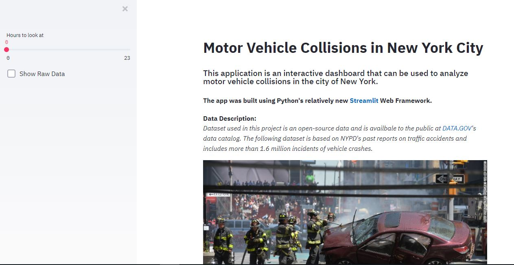
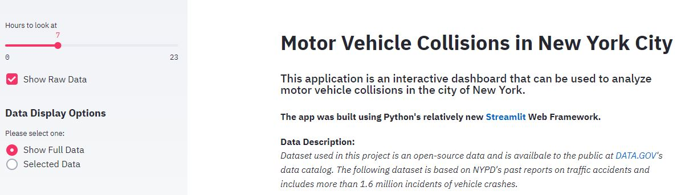
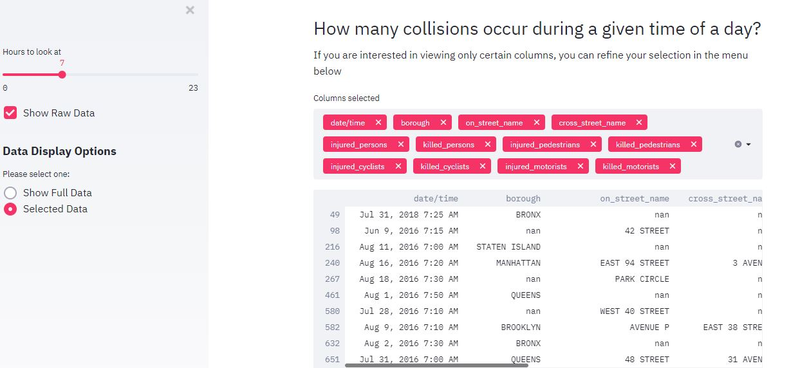
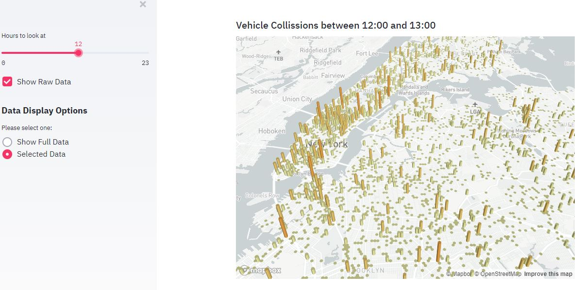
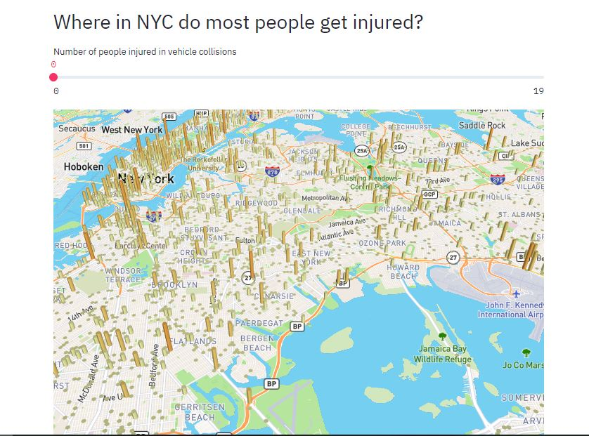
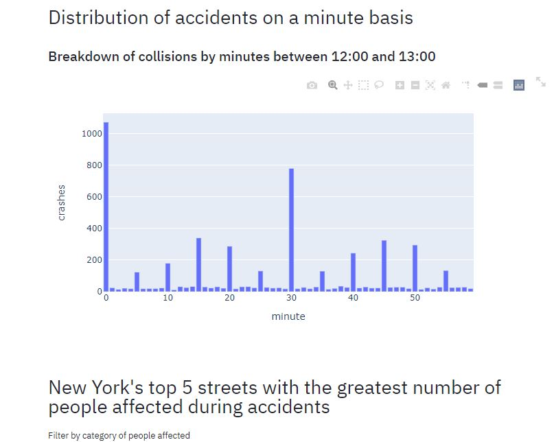

# Car Accidents Analysis Dashboard using Python's Streamlit Web Framework

**Comments regarding app.py:**

1. The purpose behind this project was to create a simple web app (dashboard) that allows users to interactively analyze data 
related to vehicle accidents in New York.

2. **In order to run the app:**	

	- Open a terminal 	

	-  If current working direcotry is different, then navigate to the directory where app.py is stored
	
	- Type `streamlit run app.py`

	

3. The list of all libraries and their respective versions that were used to create this project is given in **requirements.txt** file. Please refer to it in case of a necessity.

4. Original CSV file includes more than 1.6 million incidents of vehicle collisions. However, for the sake of memory saving (since this app was created for demo purposes) only 100,000 rows were fed into the application as an input data. To obtain the full dataset, please visit NYC Open Data website [here](https://data.cityofnewyork.us/Public-Safety/Motor-Vehicle-Collisions-Crashes/h9gi-nx95)

<**Below are given some actual screenshots showing how the web app looks like when it is displayed in the browser.**>

<**Note: **> They were taken using Windows Snipping Tool, so the quality might not be the best. But at least this gives an overall picture of how the dashboard app looks like.

 

 

 

 

 

